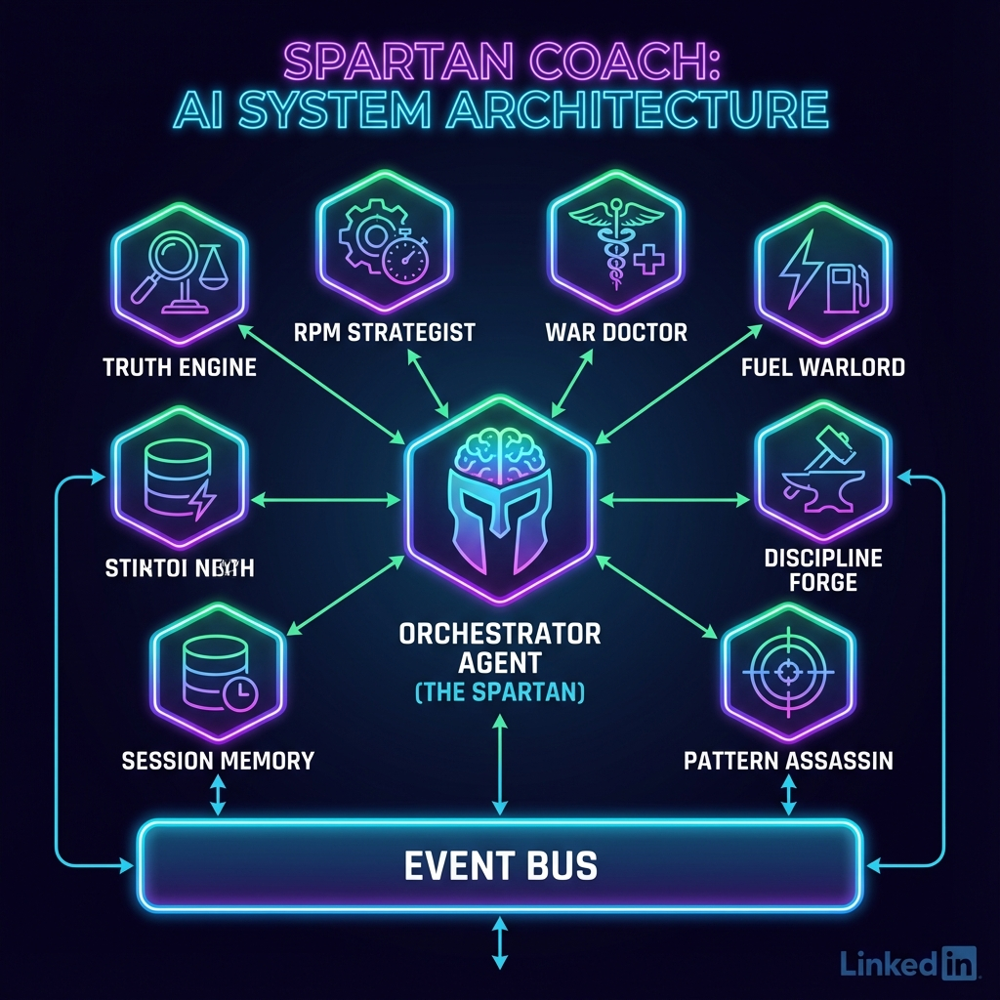

# THE SPARTAN COACH


> **"DISCIPLINE IS FREEDOM."**

## Overview

**Spartan Coach** is an AI-powered accountability engine designed to forge you into a warrior. Unlike standard fitness apps that simply track numbers, The Spartan Coach uses a multi-agent system to create personalized plans, enforce discipline, and adapt to your progress.

It doesn't just suggest workouts; it demands execution.

## The Problem

Most fitness applications fail because they lack:
1.  **True Accountability**: Notifications are easily ignored.
2.  **Adaptive Planning**: Static plans don't adjust when life happens.
3.  **Personality**: Generic advice feels robotic and uninspiring.

## The Solution

Spartan Coach solves this with a **Phalanx of AI Agents** led by **THE SPARTAN**. This system:
-   **Interviews you** to understand your goals and constraints.
-   **Forges a Master Plan** tailored to your physiology and timeline.
-   **Tracks your daily execution** (workouts, nutrition, recovery).
-   **Adapts dynamically** based on your feedback and metrics.
-   **Speaks with authority**, using a tough, motivating persona to keep you on the war path.

## Architecture

The application is built on a multi-agent architecture using the Google Agent Development Kit (ADK).



### The Phalanx (Agents)

1.  **THE SPARTAN (Commander)**: The central orchestrator. It manages the user relationship, routes tasks to sub-agents, and enforces the "Spartan" persona.
2.  **PLANNER AGENT**: The strategist. Responsible for creating the initial "Master Plan" (phases, macro targets, workout splits) based on user profile data.
3.  **FITNESS AGENT**: The drill instructor. Generates specific daily workouts based on the Master Plan and user feedback.
4.  **NUTRITION AGENT**: The fuel warlord. Provides meal plans and macro adjustments.
5.  **MONITORING AGENT**: The scout. Analyzes progress logs, weight data, and recovery metrics to suggest plan adjustments.

## Tech Stack

-   **Backend**: Python, FastAPI, Google Agent Development Kit (ADK), Google Gen AI SDK (Gemini 2.0 Flash).
-   **Frontend**: HTML5, CSS3 (Vanilla), JavaScript.
-   **Database**: SQLite (via SQLAlchemy).
-   **State Management**: Server-side session management with direct database persistence.

## Setup Instructions

### Prerequisites

-   Python 3.10 or higher
-   Google Cloud Project with Vertex AI API enabled
-   Application Default Credentials configured

### Installation

1.  **Clone the repository**:
    ```bash
    git clone <repository-url>
    cd spartancoach
    ```

2.  **Install dependencies**:
    ```bash
    pip install -r requirements.txt
    ```

3.  **Set up authentication**:
    Ensure you have your Google Cloud credentials set up:
    ```bash
    gcloud auth application-default login
    ```

### Running the Application

1.  **Start the server**:
    ```bash
    python server.py
    ```

2.  **Access the interface**:
    Open your browser and navigate to:
    `http://localhost:8000`

## Usage Guide

1.  **Onboarding**:
    -   Enter your profile details (Name, Age, Height, Weight, Goal, Target Date).
    -   Click "INITIATE PROTOCOL".
    -   The Planner Agent will generate your **Master Plan**.

2.  **Command Center (Chat)**:
    -   Review your Master Plan.
    -   Type "Accept" to lock the plan.
    -   Interact with the coach:
        -   "Give me today's workout"
        -   "Here is my meal log..."
        -   "I'm feeling tired today"

3.  **War Room (Dashboard)**:
    -   View your progress charts (Weight, Body Fat, Recovery, Strain).
    -   Upload screenshots of your fitness data (e.g., from Whoop or smart scales) for analysis.

## Project Structure

-   `server.py`: Main FastAPI application and endpoint definitions.
-   `spartan_phalanx/`: Core agent logic.
    -   `main.py`: Definition of THE SPARTAN agent.
    -   `sub_agents/`: Definitions for Planner, Fitness, Nutrition, and Monitoring agents.
    -   `tools/`: Custom tools for state management and data processing.
-   `static/`: Frontend assets (HTML, CSS, JS).
-   `docs/`: Documentation and images.

---

**PREPARE FOR GLORY.**
